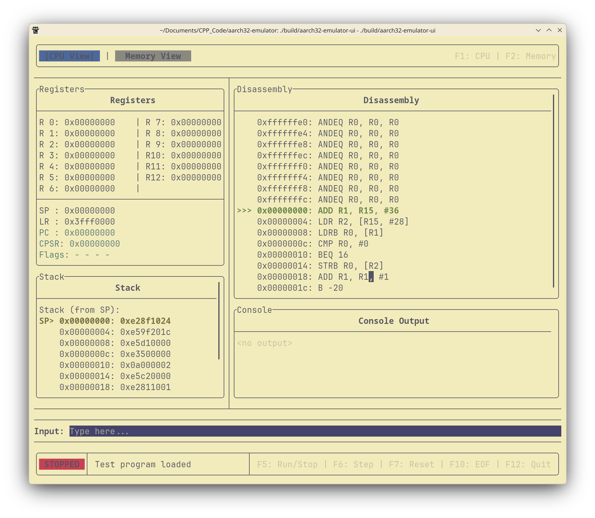
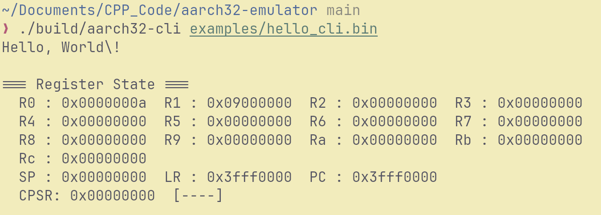

# AArch32 Emulator


An AArch32 (ARM 32-bit) instruction set emulator written in C++20. It comes with an interactive terminal debugger (FTXUI-based) and a headless CLI runner for batch execution.

## Features

- ARM data processing: MOV, ADD, SUB, AND, ORR, EOR, BIC, RSB, ADC, SBC, RSC, MVN, CMP, CMN, TST, TEQ (with immediate and register-shifted operands)
- Load/store: LDR, LDRB, STR, STRB (immediate and register offsets, pre/post-indexed)
- Block data transfer: LDM, STM
- Branch: B, BL, BX, BLX
- Multiply/divide: MUL, MLA, SDIV, UDIV
- Full condition code support (EQ, NE, CS, CC, MI, PL, VS, VC, HI, LS, GE, LT, GT, LE, AL)
- Flag-setting variants (S suffix)
- Barrel shifter (LSL, LSR, ASR, ROR)
- Memory-mapped console I/O
- Interactive debugger with register, disassembly, stack, and memory views
- Headless CLI for piping and scripting

## Install

Download pre-built binaries from the [Releases](https://github.com/e45lee/aarch32-emulator/releases) page. Builds are provided for Linux, macOS, and Windows.

```bash
# Linux
chmod +x aarch32-emulator-ui-linux aarch32-cli-linux

# macOS
chmod +x aarch32-emulator-ui-macos aarch32-cli-macos

```

On macOS you may need to remove the quarantine attribute:

```bash
xattr -d com.apple.quarantine aarch32-emulator-ui-macos aarch32-cli-macos

```

## Build from Source

Requires CMake 3.22+ and a C++20 compiler (GCC 12+, Clang 15+, MSVC 2022+). Dependencies (FTXUI, Catch2) are fetched automatically.

```bash
cmake -B build -DCMAKE_BUILD_TYPE=Release
cmake --build build --config Release

```

Binaries are placed in `build/` (or `build/Release/` on Windows):

* `aarch32-emulator-ui` -- interactive debugger

* `aarch32-cli` -- headless CLI runner

* `aarch32-emulator-tests` -- test suite

### Run Tests

```bash
cd build && ctest --build-config Release

```

## Usage

### Interactive Debugger

```bash
./build/aarch32-emulator-ui [program.bin] [--r0 VALUE] ... [--r12 VALUE]

```

If no file is given, a built-in test program is loaded.

**Keyboard controls:**

| Key | Action |
| --- | --- |
| `F1` | Switch to CPU View |
| `F2` | Switch to Memory View |
| `F5` | Toggle Run/Stop continuous execution |
| `F6` | Step forward one instruction |
| `F7` | Reset CPU and reload binary |
| `F10` | Signal EOF to console input |
| `F12` | Quit |

*Note: In Memory View (`F2`), use the `PageUp`/`PageDown` and `Arrow` keys to navigate the memory space.*

The debugger shows live disassembly, registers (with change highlighting), stack contents, and a console I/O panel. Type into the console input field and press Enter to provide input to the running program.

### CLI Runner

```bash
./build/aarch32-cli <program.bin> [--r0 VALUE] ... [--r12 VALUE]

```

Runs the program to completion. Console I/O uses stdin/stdout directly. Register state is dumped to stderr on exit. Register values can be decimal or hex with `0x` prefix.

*Note: To prevent infinite loops, the CLI will automatically halt execution after `0xFFFFFFFF` instructions.*

## Memory Map

| Address | Purpose |
| --- | --- |
| `0x00000000` -- `0x00FFFFFF` | Code and data (16 MiB) |
| `0x09000000` | Console output (write a byte to print a character) |
| `0x09000004` | Console input (read a word; returns the character, or `0xFFFFFFFF` on EOF) |
| `0x09000008` | Console status (bit 0: EOF reached) |
| `0xFF000000` -- `0xFFFFFFFF` | Stack / heap (16 MiB) |

Programs halt by branching to the address stored in LR at startup (`0x3FFF0000`), so a `BX LR` from the top-level entry point will stop execution.

## Examples

Pre-assembled binaries are included in `examples/`.

### Run a hello world program

```bash
./build/aarch32-cli examples/hello_cli.bin

```

### Echo stdin until EOF

```bash
echo "Hello World" | ./build/aarch32-cli examples/echo_until_eof.bin

```

### Pass initial register values

```bash
./build/aarch32-cli examples/add_numbers_cli.bin --r0 25 --r1 17

```

### Step through a program interactively

```bash
./build/aarch32-emulator-ui examples/hello_world.bin

```

### Write your own programs

Programs are flat binaries loaded at address `0x00000000`. You can create them with an ARM cross-assembler or by packing instruction words with Python:

```python
import struct

instructions = [
    0xE3A0002A,  # MOV R0, #42
    0xE1A0F00E,  # MOV PC, LR  (halt)
]

with open("program.bin", "wb") as f:
    for instr in instructions:
        f.write(struct.pack("<I", instr))

```

See `examples/create_echo_programs.py` for more complete examples including loops and MMIO console I/O.
